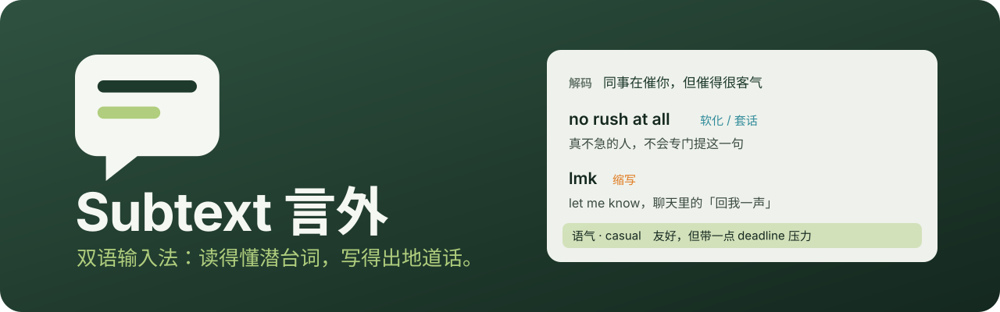
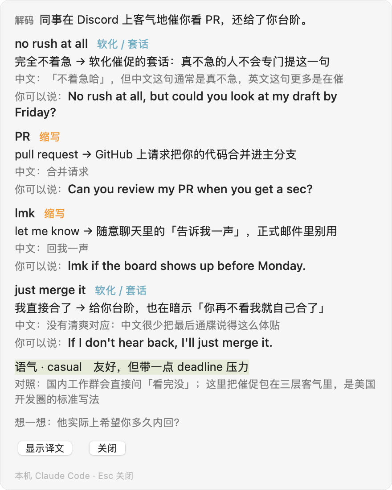
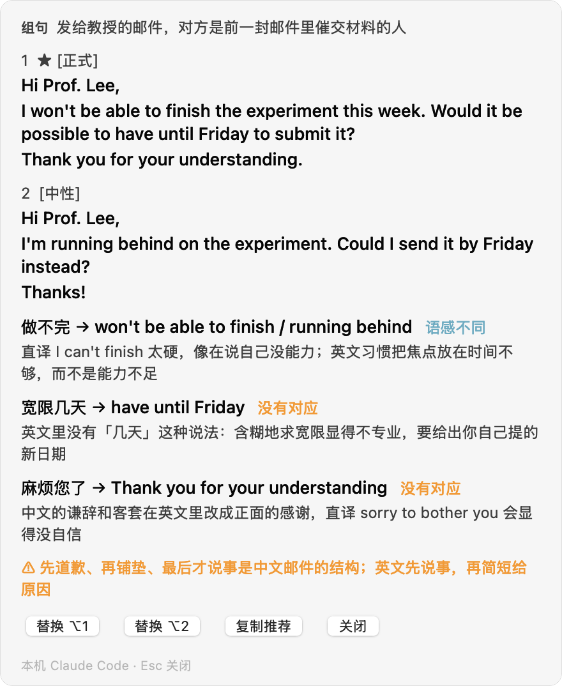

<p align="center">
  
</p>

<p align="center">
  <a href="https://github.com/StarryGuli/subtext/releases/latest"></a>
  
  
  <a href="LICENSE"></a>
</p>

<p align="center">
  <a href="#安装">安装</a> ·
  <a href="#三个场景">三个场景</a> ·
  <a href="#选一个后端">后端</a> ·
  <a href="#隐私">隐私</a> ·
  <a href="docs/usage.md">使用说明</a> ·
  <a href="#from-source-english">English</a>
</p>

**Subtext（言外）是一款带 AI 教练的中英双语输入法。** 平时它就是一个好用的拼音输入法，候选旁有译词；
一旦你复制了一段英文，或者打完了一句中文，教练就会出现，帮你读懂对方没说出口的意思，也帮你写出母语者会这样说的英文。

它想解决的不是「这句话什么意思」，而是更难的两件事：**语气和潜台词**。
美式职场英语习惯把硬话说软（`we may want to revisit this` 往往就是不行），而中文的客套话直译成英文又会显得没自信。
这些词典里查不到，Subtext 专门讲这个。

## 三个场景

<table>
<tr>
<td width="33%"><b>① 复制英文 → 解码</b><br>别人发来一段英文，复制它，面板自动出现：情境、俚语与缩写、语气、潜台词。<b>译文默认折叠</b>，让你先自己猜。</td>
<td width="33%"><b>② 打中文 → 给出英文</b><br>打完一句中文停一下，给出可直接发送的英文，按场合选随意 / 中性 / 正式，并说明为什么这样说。按 <kbd>⌥1</kbd> 直接替换刚打的中文。</td>
<td width="33%"><b>③ 选中文字 → 改稿</b><br>选中自己写的英文，按 <kbd>⌃⌥E</kbd>：修正版在前，逐条说明；刻意的随意写法（全小写、<code>u</code>）不当成错。</td>
</tr>
</table>

<p align="center">
  <picture>
    <source media="(prefers-color-scheme: dark)" srcset="assets/screenshots/decode-dark.png">
    
  </picture>
  &nbsp;
  <picture>
    <source media="(prefers-color-scheme: dark)" srcset="assets/screenshots/compose-dark.png">
    
  </picture>
</p>

<p align="center"><sub>示例内容。面板是不抢焦点的浮窗，应用里的光标不会丢；Esc 关闭。</sub></p>

教练会结合上下文决定语气：当前应用（邮件偏正式，聊天偏随意、可以缩写）、你最近解码过的那条对方消息、你最近打的字。

## 安装

要求：macOS 13 或更新，Apple Silicon（M 系列）。

1. 从 [Releases](https://github.com/StarryGuli/subtext/releases/latest) 下载 `subtext-*-macos-arm64.pkg`，核对 `SHA256SUMS`。
2. 双击安装（需要管理员密码）。安装包使用 ad-hoc 签名，**第一次打开要在「系统设置 → 隐私与安全性」里点「仍要打开」**。
3. 安装完成后输入法会自动加进系统输入源。点菜单栏的输入法图标，选「言外」。列表里没有就注销再登录一次。

卸载：

```bash
/Library/Input\ Methods/Subtext.app/Contents/Resources/uninstall.sh          # 保留学习数据与配置
/Library/Input\ Methods/Subtext.app/Contents/Resources/uninstall.sh --purge  # 连数据、配置、日志一起删
```

## 开始用教练

教练**默认关闭**。输入法菜单 → 偏好设置 → **双语教练**：

1. 选一个后端（见下表），本机命令行后端不需要密钥，API 后端填密钥后按回车保存。
2. 点「测试连接」，确认通了。
3. 勾上「启用双语教练」。也可以直接在输入法菜单里点「双语教练」开关。

之后：复制英文自动解码；打完中文停一下自动出英文；选中文字按 <kbd>⌃⌥E</kbd> 交给教练。教练只在言外是当前输入法时工作。

## 选一个后端

| 后端 | 需要什么 | 适合谁 |
|---|---|---|
| **本机 Claude Code** | 终端里装好并登录过 `claude` | 有 Claude 订阅，不想另付 API 费用 |
| **本机 Codex** | 终端里装好并登录过 `codex` | 有 Codex 订阅（目前未在真机上验证，见下） |
| **OpenAI 兼容接口** | 接口地址 + 模型 + 密钥（DeepSeek、OpenRouter、自建服务都行） | 想要便宜、低延迟 |
| **Anthropic API** | Anthropic 密钥 | 要最好的质量，按量计费 |

> **Codex 后端的说明**：按 `codex exec` 的文档接入，单元测试用假命令覆盖了调用方式，但作者的机器上没有装 Codex，没有真实跑通过。遇到问题请开 Issue。

命令行后端的调用会限定只读项目级配置、关闭所有工具、不留会话，你本机的插件钩子和全局记忆不会混进教练的回复。

## 隐私

- **默认什么都不发。** 拼音转换、词库、学习、候选译词全部在本机完成，教练关着时没有任何网络请求。
- 开启教练后，**复制的英文与上屏的中文会发往你选的后端**，云端后端首次启用前请确认你接受这一点。
- 以下内容**绝不发送**：密码框（Secure Input）、密码管理器标记的隐蔽剪贴板内容、疑似密钥 / 口令 / 卡号的文本、链接与代码、超过长度上限的文本、你在 `skip_apps` 里列出的应用（缺省包含 1Password、Bitwarden、钥匙串）。
- 复制的文本被当作**待处理的数据**，不是指令：里面写着「忽略之前的指令」也不会生效。
- 密钥只存在这台电脑上（配置目录的 `.env`），不进配置文件，不进日志。
- 检查更新每天向 GitHub Releases 读一次版本列表，请求不带任何标识，可以在偏好设置里关掉。

## 配置

配置文件在 `~/Library/Application Support/Subtext/config.toml`，改了自动生效。教练的部分：

```toml
[coach]
enabled = true
backend = "claude-cli"          # claude-cli | codex-cli | openai | anthropic
auto_decode = true
auto_compose = true
claude_model = "haiku"
openai_base_url = "https://api.deepseek.com"
openai_model = "deepseek-v4-flash"
skip_apps = ["com.1password.1password"]
# profile = "…"                  # 学习者画像：写得越贴近你，教练越对症

[shortcut]
coach_selection = "control+option+e"
```

完整说明见 [docs/usage.md](docs/usage.md)。

## From source (English)

Subtext is a bilingual (Chinese–English) pinyin input method for macOS with an AI coach built in.
Copy an English message and it decodes the tone and subtext; type a Chinese sentence and it writes the English a native speaker would use.
Backends: local Claude Code CLI, local Codex CLI, any OpenAI-compatible API, or the Anthropic API. Off by default; nothing leaves your machine until you enable it.

```bash
# Rust 1.96 via rustup, Xcode command line tools, ~10 GB free disk
git clone https://github.com/StarryGuli/subtext && cd subtext
# product data (dictionaries, language model; ~140 MB) from the upstream data release:
gh release download data-v3 -R qingjian-team/qingjian -D data/dl && tar -xzf data/dl/qingjian-data.tar.gz -C data && mv data/data/* data/ && rmdir data/data
apps/macos/scripts/bundle.sh --pkg      # -> target/pkg/subtext-<version>-macos-arm64.pkg
cargo test --workspace
```

The coach core (`crates/subtext-coach`) is platform-independent and has its own CLI:
`cargo run -p subtext-coach -- "hey, no rush but did you get a chance to look at that PR?"`.

## 构建与贡献

```bash
cargo test --workspace && cargo clippy --workspace --all-targets -- -D warnings
cargo run -p subtext-coach -- "要解码或翻译的文字"      # 直接试教练，不经过输入法
cargo run -p subtext-cli -- zhongwen                    # 试输入法内核
```

架构与约定见 [docs/design/architecture.md](docs/design/architecture.md)、[docs/design/coach.md](docs/design/coach.md) 与 [CONTRIBUTING.md](CONTRIBUTING.md)。

## 致谢与许可

Subtext 的输入法内核（拼音转换、词库、整句模型、候选窗口）基于开源项目 [青简 Qingjian](https://github.com/qingjian-team/qingjian) 二次开发，感谢他们。
这是独立的衍生项目，不并回上游；移除了 Windows / Linux 外壳，更换了名称与图标，加入了双语教练与 GitHub Releases 更新检查。

代码采用 [GPL-3.0-or-later](LICENSE)。青简的项目名称与 logo 不包含在代码授权内，本项目不使用。
随包数据有各自的来源与许可，见 [数据来源清单](docs/design/landscape.md) 与应用内「关于」页。
